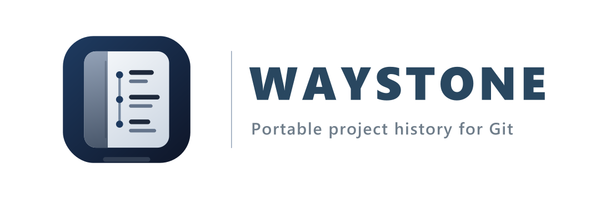

<p align="center">
  
</p>
<p align="center">
  <a href="https://goreportcard.com/report/github.com/steadytao/waystone" rel="noopener noreferrer"></a>
  &nbsp;
  <a href="https://www.bestpractices.dev/projects/12723"></a>
  &nbsp;
  <a href="https://scorecard.dev/viewer/?uri=github.com/steadytao/waystone"></a>
</p>

Waystone is a local CLI for exporting and managing portable project history for Git repositories.

Git keeps the code. Waystone keeps the trail.

Waystone imports issues, pull requests, comments, labels, milestones and releases into a local `.waystone/` ledger. The goal is to let a project preserve the context around its code without treating one forge as the permanent owner of that history.

Waystone is experimental research software. It is not ready for production use.

## Menu

- [Status](#status)
- [What Waystone Is](#what-waystone-is)
- [What Waystone Is Not](#what-waystone-is-not)
- [Install](#install)
- [Quick Start](#quick-start)
- [Command Surface](#command-surface)
- [Ledger Model](#ledger-model)
- [GitHub Import](#github-import)
- [Archive Import and Export](#archive-import-and-export)
- [Security and Privacy](#security-and-privacy)
- [Documentation](#documentation)
- [Development](#development)
- [Contributing](#contributing)
- [Governance](#governance)
- [Support](#support)
- [Code of Conduct](#code-of-conduct)
- [Security](#security)
- [Licence](#licence)
- [Changelog](#changelog)

## Status

Waystone is in early development.

The current prototype includes:
- GitHub OAuth device flow login
- `GITHUB_TOKEN` override support
- GitHub repository import
- GitHub exit-readiness audit for workflow, policy, release and project-metadata surfaces
- local ledger storage under `.waystone/`
- source manifests for imported repositories
- issue and pull request browsing
- comment and timeline views
- label and milestone listing
- local issue creation, editing, labels, comments, close and reopen under `waystone:` sources
- local issue and pull request search
- operation records for ledger-changing and verification commands
- object hashes and strict ledger verification
- local Ed25519 signing for new operation records and source manifests
- local trust policy for Waystone signing identities
- ledger archive export, manifest signing, inspection and import
- GoReleaser-based release structure with checksums, SBOMs and Sigstore bundles

Published releases will appear here:
- <https://github.com/steadytao/waystone/releases>

## What Waystone Is

Waystone currently aims to be:
- a local ledger for imported project history
- a portable record format for Git repository collaboration data
- a migration aid for projects moving between forges
- a preservation tool for project context around code
- signed provenance for operations, source manifests and archive manifests

The narrow product thesis is:
```text
Git is distributed. Project collaboration is not.
```

## What Waystone Is Not

Waystone is not currently:
- a GitHub clone
- a hosted forge
- a CI platform
- a social network
- a replacement for Git
- a replacement for Radicle, ForgeFed, Forgejo or SourceHut
- a production-ready security boundary

It also does not execute imported data, run webhooks, host attachments, crawl repositories or provide vulnerability-scanning behaviour.

## Install

You can build Waystone from source:
```bash
git clone https://github.com/steadytao/waystone.git
cd waystone
go build -o waystone ./cmd/waystone
```

On Windows, use `.\waystone.exe` instead of `./waystone`.

Published releases will include platform archives, `checksums.txt`, a Sigstore bundle for the checksum manifest, per-archive SPDX SBOMs and matching Sigstore bundles. See [docs/releases/README.md](docs/releases/README.md) for release verification guidance.

## Quick Start

Authenticate with GitHub:
```bash
waystone github auth login
```

Create a local operation-signing identity:
```bash
waystone identity init
```

Audit GitHub migration surfaces:
```bash
waystone github audit steadytao/waymark
```

Import a repository into the default `.waystone/` ledger:
```bash
waystone github import steadytao/waymark
```

Set a default source for browsing commands:
```bash
waystone source default github:steadytao/waymark
```

Browse imported records:
```bash
waystone issue list
waystone issue create --source steadytao/waystone --title "Example local issue"
waystone label create --source steadytao/waystone --slug bug --name "Software Issue"
waystone issue label add --source steadytao/waystone --issue 1 bug
waystone issue edit --source steadytao/waystone --issue 1 --title "Updated local issue"
waystone issue comment --source steadytao/waystone --issue 1 --body "Example comment"
waystone issue close --source steadytao/waystone --issue 1
waystone issue reopen --source steadytao/waystone --issue 1
waystone issue show 15
waystone issue comments 15
waystone pr list
waystone pr show 14
waystone label list
waystone milestone list
```

Verify the ledger:
```bash
waystone ledger verify --strict
waystone ledger verify --strict --signatures
waystone ledger doctor
waystone ledger status
```

## Command Surface

Current command groups:
```bash
waystone github auth login
waystone github auth logout
waystone github audit owner/repo
waystone github import owner/repo
waystone github refresh owner/repo

waystone identity init
waystone identity list
waystone identity show
waystone identity status
waystone identity trust <identity-id>
waystone identity untrust <identity-id>

waystone audit list
waystone audit show <audit-id>

waystone source list
waystone source default [source]
waystone source show <source>
waystone source inspect <source>
waystone source refresh
waystone source status

waystone issue list
waystone issue create --source owner/repo --title <title>
waystone issue edit --source owner/repo --issue <number>
waystone issue comment --source owner/repo --issue <number>
waystone issue close --source owner/repo --issue <number>
waystone issue reopen --source owner/repo --issue <number>
waystone issue search <text>
waystone issue search --state open <text>
waystone issue list --source waystone:owner/repo --state closed
waystone issue show <number>
waystone issue comments <number>
waystone issue timeline <number>

waystone pr list
waystone pr search <text>
waystone pr show <number>
waystone pr comments <number>
waystone pr timeline <number>

waystone label list
waystone milestone list

waystone ledger summary
waystone ledger status
waystone ledger history
waystone ledger show-operation <operation-id>
waystone ledger diff --source <source> --since <operation>
waystone ledger verify --strict
waystone ledger doctor
waystone ledger export
waystone ledger inspect <archive>
waystone ledger import <archive>

waystone migrate report --from <source> --to <source>
```

Most browsing commands accept `--source <system>:<owner>/<repo>`, for example `github:owner/repo`. If no source is supplied, Waystone uses the default source in `ledger.json` when one is set.

## Ledger Model

Waystone stores data in a local `.waystone/` directory.

The current layout is:
```text
.waystone/
  ledger.json
  projects/
  objects/
  imports/
  identities/
  operations/
```

The ledger is intended to preserve:
- what source was imported
- what source was audited
- what records were written, updated or verified
- when commands ran
- which authenticated GitHub account was used where relevant
- object hashes for local integrity checking
- operation-chain links for strict verification
- operation signatures when a local identity exists
- source manifest signatures when a local identity exists

Sources are repo-specific namespaces. GitHub imports use `github:owner/repo`; `waystone:owner/repo` is reserved for local Waystone records. Issue, pull request and milestone numbers are source-local, so overlapping numbers across sources do not imply the same record.

`waystone migrate report` uses those source namespaces to report what a migration can preserve, what remains local continuation history and what still needs a migration plan. It is read-only and does not assign target IDs.

See [docs/ledger-format.md](docs/ledger-format.md) and [docs/operations.md](docs/operations.md).

## GitHub Import

GitHub import currently preserves:
- issues
- issue comments
- pull requests
- pull request review comments
- labels
- milestones
- releases
- source manifests
- import operation records

`GITHUB_TOKEN` always takes precedence and is never persisted by Waystone.

Without `GITHUB_TOKEN`, `waystone github auth login` uses the GitHub OAuth device flow and stores the token in the operating system credential store. Use `OAUTH_CLIENT_ID` or `--client-id` to use your own OAuth app. Use `--plain-file-store` only as an explicit development fallback when the OS credential store is unavailable.

## Archive Import and Export

The default ledger export is a compressed archive intended for portable preservation and transfer.

Safe import verifies the archive manifest and the extracted Waystone ledger before replacing local state. `--unsafe` exists only as an explicit escape hatch for controlled development or recovery work and should not be used for untrusted archives.

Importing Waystone data must never execute anything.

## Security and Privacy

Waystone is local-first and privacy-minimal by default.

Operation records may include the authenticated GitHub login. Local OS username and hostname are only recorded when `--local` is explicitly used.

Waystone does not claim that local hashes, operation chains or signatures prevent a user with filesystem access from editing the ledger. They provide detection for accidental edits, unsynchronised local mutation and invalid operation signatures.

`waystone identity init` creates and locally trusts an Ed25519 identity for operation, source manifest and archive manifest signing. Public identity metadata and trust policy are stored in the ledger. Private signing material is local key material and is excluded from ledger exports.

## Documentation

Start with [docs/README.md](docs/README.md).

Core documents:
- [docs/cli.md](docs/cli.md), command reference
- [docs/examples.md](docs/examples.md), common command workflows
- [docs/self-import.md](docs/self-import.md), self-import validation flow
- [docs/local-issue-ledger.md](docs/local-issue-ledger.md), local Waystone issue records
- [docs/ledger-format.md](docs/ledger-format.md), `.waystone/` layout and archive model
- [docs/operations.md](docs/operations.md), operation records and command history
- [docs/privacy.md](docs/privacy.md), token and actor metadata handling
- [docs/security.md](docs/security.md), practical security notes
- [docs/signing.md](docs/signing.md), operation signing model
- [docs/roadmap.md](docs/roadmap.md), phased development plan

Architecture:
- [docs/architecture/design.md](docs/architecture/design.md), design thesis and product boundary
- [docs/architecture/object-model.md](docs/architecture/object-model.md), imported records and future event model
- [docs/architecture/threat-model.md](docs/architecture/threat-model.md), trust, authority and abuse risks
- [docs/architecture/decisions/](docs/architecture/decisions/), ADRs

Project context:
- [docs/product/prior-art.md](docs/product/prior-art.md), comparison with adjacent projects
- [docs/releases/README.md](docs/releases/README.md), release process and integrity assets

## Development

Development docs:
- [docs/development/standards.md](docs/development/standards.md)
- [docs/development/testing.md](docs/development/testing.md)
- [AGENTS.md](AGENTS.md)

Useful local checks:
```bash
go test ./...
go vet ./...
go build ./cmd/waystone
go mod tidy -diff
go mod verify
staticcheck ./...
gosec ./...
govulncheck ./...
```

The CI surface also includes action pinning, file header checks, workflow validation, Go Report Card, CodeQL, Scorecard and release verification.

## Contributing

Before opening an issue or pull request, read [CONTRIBUTING.md](CONTRIBUTING.md).

All commits must be signed off in accordance with the Developer Certificate of Origin. See [DCO.md](DCO.md).

## Governance

Governance is documented in [GOVERNANCE.md](GOVERNANCE.md), [MAINTAINERS.md](MAINTAINERS.md) and [CODEOWNERS](CODEOWNERS).

## Support

Support expectations are documented in [SUPPORT.md](SUPPORT.md).

## Code of Conduct

Project conduct expectations are documented in [CODE_OF_CONDUCT.md](CODE_OF_CONDUCT.md).

## Security

Please do not report security vulnerabilities in public issues.

See [SECURITY.md](SECURITY.md) for reporting guidance.

## Licence

Waystone is released under the Apache License 2.0. See [LICENSE](LICENSE).

## Changelog

See [CHANGELOG.md](CHANGELOG.md).
